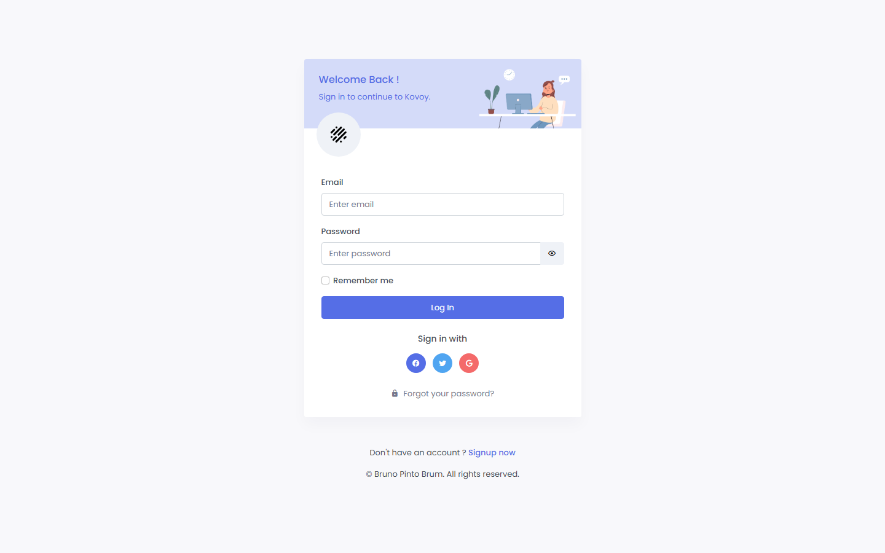
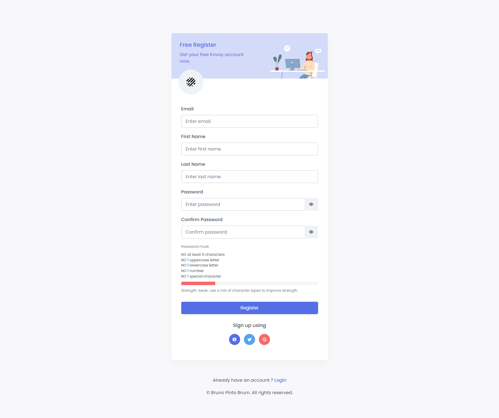
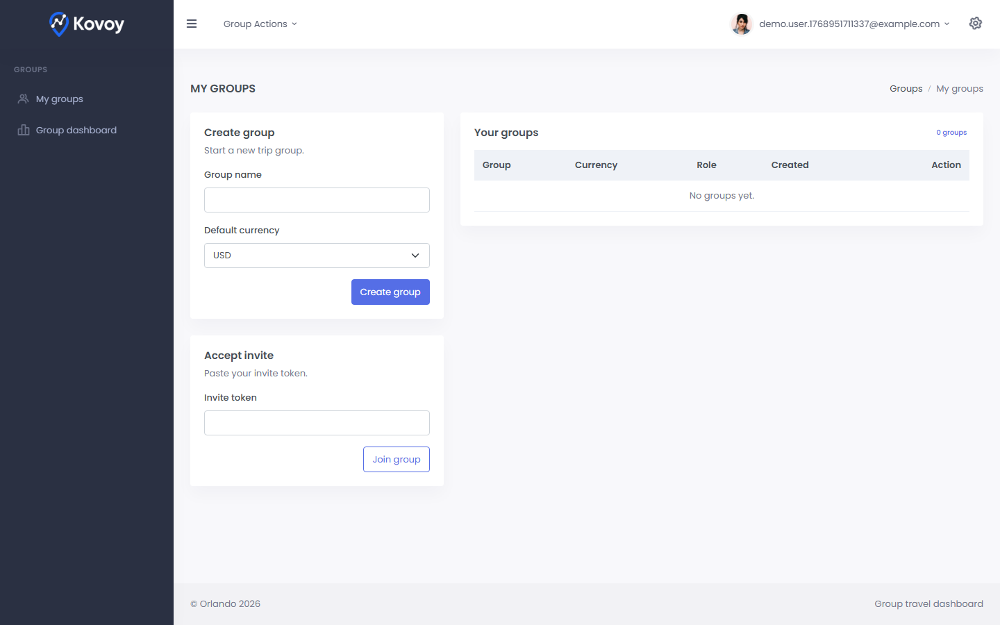
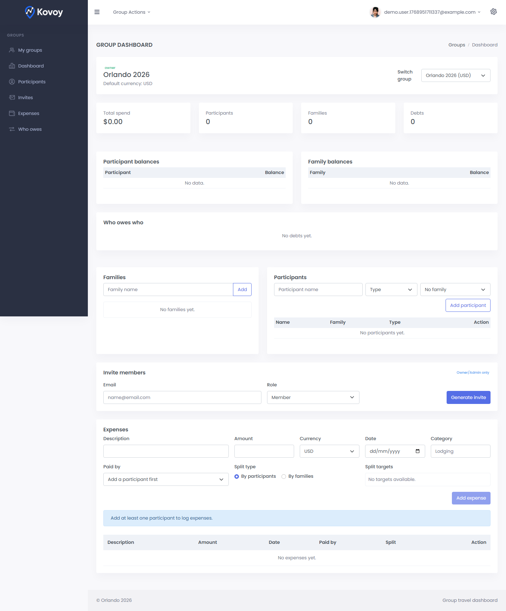

# Orlando 2026

App web com autenticacao (email/senha e Google OAuth) e painel protegido para organizar viagens em grupo (grupos, participantes, despesas, saldos e quem deve pra quem).

Deploy: sem deploy publico no momento.

## Demo






Video curto (opcional): (adicione o link aqui)

## Features

- Login com email/senha (JWT em cookie HTTP-only)
- Verificacao de email (opcional por config)
- Two-factor por email (opcional por config)
- Refresh tokens e expiracao configuravel
- Tela de login baseada no template Skote (UI fiel)
- Cadastro com email, primeiro nome, sobrenome, senha e confirmacao de senha
- Logout, perfil e recuperacao de senha
- Login social via Google OAuth
- Foto do usuario via Google (campo `avatar_url`)
- Grupos: criar e listar, membership por groupId
- Convites: criar e aceitar convite
- Convites: expiracao e bloqueio de reuso
- Familias e participantes (pessoas sem login)
- Despesas com split igual por pessoa, familia ou manual
- Validacao da soma do split
- Dashboard do grupo com saldos e "quem deve pra quem"
- Modulos do grupo (CRUD): voos, hospedagens, transportes e tickets
- Voos V2: flight number, class, status, assentos/bagagens por passageiro e autocomplete de aeroportos (From/To)
- Voos V2: o campo Airline utiliza autocomplete/datalist via `/api/airlines`, registra `airline_id` e permite adicionar novas companhias.
- Voos V2: From/To utiliza autocomplete via `/api/airports` e grava `from_airport_id`/`to_airport_id` quando ha match.
- Hospedagens V2: endereco completo, quartos, check-in/out com hora e status
- Transportes V2: origem/destino, datas/horas, fornecedor/localizador, status e observacoes
- Tickets V2: tipo, data/hora, local, status e vinculo a participantes
- Modulos V2: quando vinculados a uma despesa, replicam o pagador, tipo/mode e alvos do split configurados no painel
- Protecao CSRF para operacoes de escrita
- Rate limiting e headers de seguranca

## Financeiro (MVP)

- O controle financeiro (pagador e divisao) acontece somente em Expenses.
- Os modulos de voos/hospedagens/transportes/tickets sao registros logísticos com custo estimado.
- Para refletir pagamentos reais, crie uma despesa correspondente em Expenses.
- Base V2: os modulos permitem vincular uma despesa (link opcional na UI).
- A despesa vinculada herda automaticamente o pagador, o tipo/mode (participants/families/manual) e os alvos definidos no painel, garantindo que a mesma configuração do split seja usada em um único fluxo.

### Roadmap

- Anexos/recibos por item (upload/preview)
- Categorias avancadas e filtros no painel
- Multi-moeda e cambio por data
- Timeline do grupo e notificacoes
- Importacao/exportacao (CSV/JSON)
- Auditoria de alteracoes
- Ampliar cobertura E2E e testes de seguranca
- CI/CD basico com lint/test/build
- Observabilidade (logs estruturados/metrics)

## Stack e arquitetura

- Node.js + Express
- SQLite (better-sqlite3)
- Auth: JWT em cookie + Google OAuth
- Seguranca: Helmet, rate limit
- Arquitetura: monolito simples (API + static files no mesmo servidor)
- Dados locais: `data/app.db` (ou `DB_PATH`)

Diagrama simples:

```
[Browser] -> [Express API + Static] -> [SQLite data/app.db]
```

## Banco de dados

Schema criado automaticamente no boot. Tabelas principais:

- `users`, `refresh_tokens`, `email_verification_tokens`, `reset_tokens`, `two_factor_codes`
- `groups`, `group_members`, `invitations`
- `families`, `participants`
- `expenses`, `expense_splits`
- `expenses` + `expense_splits` mantem o registro do pagador e dos alvos (participants/families) usados pelos módulos logísticos
- `group_flights`, `group_flight_participants`, `group_lodgings`, `group_transports`, `group_tickets`
- `airlines` (lista única usada nos autocompletes de módulos logísticos)
- (legado) `trips`, `trip_flights`, `trip_lodgings`, `trip_cars`, `trip_expenses`, `trip_transports`, `trip_timeline`, `trip_reminders`

Resumo do schema: `docs/SCHEMA.md`.

Campos relevantes em `users`:

- `email`, `password_hash`, `google_sub`
- `first_name`, `last_name`, `display_name`, `avatar_url`
- `email_verified_at`, `two_factor_enabled`, `created_at`

Campos V2 em `group_flights`:

- `airline`, `flight_number`, `pnr`, `cabin_class`, `status`
- `airline_id` referencia a tabela `airlines` para padronizar entradas e alimentar o autocomplete.
- `from_airport_id`, `to_airport_id` referenciam `airports` para padronizar From/To.
- `cost`, `currency`, `from_city`, `to_city`, `depart_at`, `arrive_at`, `notes`, `expense_id`

Tabela de vinculo `group_flight_participants`:

- `group_id`, `flight_id`, `participant_id`, `seat`, `baggage`, `created_at`

Tabela `airports`:

- `code`, `name`, `city`, `country`, `name_normalized`, `city_normalized`

Importacao de aeroportos:

- `node scripts/import-routes.js "C:\Users\bruno\Downloads\airports.csv"` (importa aeroportos apenas)
- `node scripts/import-routes.js "C:\Users\bruno\Downloads\routes.csv" "C:\Users\bruno\Downloads\airports.csv"` (importa rotas + aeroportos)

Campos V2 em `group_lodgings`:

- `address_line2`, `city`, `state`, `postal_code`, `country`
- `check_in_time`, `check_out_time`, `room_type`, `room_quantity`, `room_occupancy`, `status`
- `contact_phone`, `contact_email`

Campos V2 em `group_transports`:

- `origin`, `destination`, `depart_at`, `arrive_at`
- `provider`, `locator`, `status`
- `amount`, `currency`, `notes`, `expense_id`

Campos V2 em `group_tickets`:

- `type`, `event_at`, `location`, `status`
- `amount`, `currency`, `notes`, `expense_id`

Tabela de vinculo `group_ticket_participants`:

- `group_id`, `ticket_id`, `participant_id`, `created_at`

## Requisitos

- Node.js 18+ (recomendado)
- NPM
- Conta Google OAuth (para login Google)

## Como rodar local

```bash
npm install
# crie o .env a partir do .env.example
npm start
```

URLs locais:

- http://localhost:3000/login
- http://localhost:3000/register
- http://localhost:3000/forgot
- http://localhost:3000/reset
- http://localhost:3000/groups (protegida)
- http://localhost:3000/dashboard?groupId=1 (protegida)

## Importar companhias aéreas

1. Baixe um CSV com as companhias (ex: [`openflights.org/data.html`](https://openflights.org/data.html) ou o `airlines.csv` que você mencionou em `C:\Users\bruno\Downloads\airlines.csv`).
2. Rode o script `node scripts/import-airlines.js <caminho>` (o caminho padrão já aponta para `C:\Users\bruno\Downloads\airlines.csv` no Windows).
3. O script insere somente nomes únicos na tabela `airlines`, garantindo o autocomplete do datalist do formulário de voos.

## Importar rotas e aeroportos

1. Baixe os arquivos `routes.csv` e `airports.csv` (por exemplo, os datastes do [OpenFlights](https://openflights.org/data.html) e do [dataset airport-codes](https://github.com/datasets/airport-codes/blob/master/data/airport-codes.csv)).
2. Rode `node scripts/import-routes.js <routes-csv> <airports-csv>`; os caminhos padrão da versão Windows estão em `C:\Users\bruno\Downloads\routes.csv` e `C:\Users\bruno\Downloads\airports.csv`.
3. O backend passa a oferecer `/api/routes/airlines?from=GRU&to=MCO`, o datalist do campo Airline é filtrado pelas cias que voam na rota (com fallback para a lista completa caso não existam rotas registradas).

## Configuracao de ambiente (.env)

Crie um arquivo `.env` na raiz do projeto. Para producao, use o modelo `/.env.production.example` e preencha os valores reais em um `.env.production`.

Tabela de variaveis:

| Variavel | Exemplo | Descricao |
| --- | --- | --- |
| PORT | 3000 | Porta do servidor (default 3000) |
| NODE_ENV | production | Habilita modo prod (cookies `secure`) |
| DB_PATH | data/app.db | Caminho do SQLite (default `data/app.db`) |
| JWT_SECRET | troque-este-segredo | Segredo para assinar JWT (obrigatorio em prod) |
| ALLOWED_ORIGINS | http://localhost:3000 | Origens permitidas (CSV) |
| APP_BASE_URL | http://localhost:3000 | Base URL usada em emails/links |
| GOOGLE_CLIENT_ID | xxx.apps.googleusercontent.com | OAuth client id do Google |
| GOOGLE_CLIENT_SECRET | xxxxx | OAuth client secret do Google |
| GOOGLE_REDIRECT_URI | http://localhost:3000/api/auth/google/callback | Callback do Google (obrigatorio em prod) |
| SEED_EMAIL | admin@exemplo.com | Usuario inicial (opcional, so se DB vazia) |
| SEED_PASSWORD | senha-forte | Senha do usuario inicial |
| SMTP_HOST | smtp.exemplo.com | Host SMTP (se vazio, email nao eh enviado) |
| SMTP_PORT | 587 | Porta SMTP |
| SMTP_USER | usuario | Usuario SMTP |
| SMTP_PASS | senha | Senha SMTP |
| SMTP_SECURE | false | TLS/SSL (true/false) |
| SMTP_FROM | no-reply@exemplo.com | Remetente dos emails |
| EMAIL_VERIFICATION_REQUIRED | true | Exige confirmacao de email |
| EMAIL_TOKEN_TTL_MINUTES | 60 | TTL do token de email |
| TWO_FACTOR_REQUIRED | false | Exige two-factor por email |
| TWO_FACTOR_TTL_MINUTES | 10 | TTL do codigo de two-factor |
| TWO_FACTOR_ATTEMPT_LIMIT | 5 | Tentativas maximas do two-factor |
| RESET_TOKEN_TTL_MINUTES | 30 | TTL do token de reset |
| ACCESS_TOKEN_TTL_MINUTES | 30 | TTL do access token |
| REFRESH_TOKEN_TTL_DAYS_SESSION | 1 | TTL do refresh token (sessao) |
| REFRESH_TOKEN_TTL_DAYS_REMEMBER | 30 | TTL do refresh token (lembrar) |

Exemplo `.env` (nao use segredos reais aqui):

```env
PORT=3000
NODE_ENV=development
DB_PATH=data/app.db
JWT_SECRET=change-me
ALLOWED_ORIGINS=http://localhost:3000
APP_BASE_URL=http://localhost:3000
GOOGLE_CLIENT_ID=seu-client-id.apps.googleusercontent.com
GOOGLE_CLIENT_SECRET=seu-client-secret
GOOGLE_REDIRECT_URI=http://localhost:3000/api/auth/google/callback
SEED_EMAIL=admin@exemplo.com
SEED_PASSWORD=senha-forte-123
SMTP_HOST=smtp.exemplo.com
SMTP_PORT=587
SMTP_USER=usuario
SMTP_PASS=senha
SMTP_SECURE=false
SMTP_FROM=nao-responder@exemplo.com
EMAIL_VERIFICATION_REQUIRED=true
EMAIL_TOKEN_TTL_MINUTES=60
TWO_FACTOR_REQUIRED=false
TWO_FACTOR_TTL_MINUTES=10
TWO_FACTOR_ATTEMPT_LIMIT=5
RESET_TOKEN_TTL_MINUTES=30
ACCESS_TOKEN_TTL_MINUTES=30
REFRESH_TOKEN_TTL_DAYS_SESSION=1
REFRESH_TOKEN_TTL_DAYS_REMEMBER=30
```

## Scripts/Comandos uteis

- `npm start`: inicia o servidor (`node server.js`)

## Skill do projeto (Codex)

Skill interna para padronizar o fluxo de trabalho do projeto.

- Arquivo: `docs/skills/orlando-project-workflow.skill`
- Uso: instalar a skill e reiniciar o Codex para carregar

## Testes

Suite de testes com Jest + Playwright.

Rodar testes:

```bash
npm test
```

Instalar navegadores do Playwright (primeira vez):

```bash
npx playwright install
```

Rodar E2E:

```bash
npm run test:e2e
```

No Windows, se houver travamento, use:

```bash
npm test -- --runInBand
```

Sugestao de padrao:

- Unit: autenticacao, tokens e validacoes
- Integration: rotas `/api/*`
- E2E: fluxo login/cadastro/grupo/despesa

## Documentacao da API

Base: `http://localhost:3000/api`

Auth:

- Cookie HTTP-only `auth_token` com JWT
- Para POST/PUT/DELETE, enviar header `x-csrf-token` com o valor do cookie `csrf_token`

Principais endpoints:

- `POST /api/login` { `email`, `password` }
- `POST /api/register` { `email`, `firstName`, `lastName`, `password`, `confirmPassword` }
- `POST /api/logout`
- `GET /api/me`
- `POST /api/forgot` { `email` }
- `POST /api/reset` { `token`, `password` }
- `GET /api/auth/google`
- `GET /api/auth/google/callback`
- `POST /api/groups`
- `GET /api/groups`
- `GET /api/groups/:groupId/members`
- `POST /api/groups/:groupId/invitations`
- `POST /api/invitations/accept`
- `GET /api/groups/:groupId/families`
- `POST /api/groups/:groupId/families`
- `PUT /api/groups/:groupId/families/:familyId`
- `DELETE /api/groups/:groupId/families/:familyId`
- `GET /api/groups/:groupId/participants`
- `POST /api/groups/:groupId/participants`
- `PUT /api/groups/:groupId/participants/:participantId`
- `DELETE /api/groups/:groupId/participants/:participantId`
- `GET /api/groups/:groupId/expenses`
- `POST /api/groups/:groupId/expenses`
- `PUT /api/groups/:groupId/expenses/:expenseId`
- `DELETE /api/groups/:groupId/expenses/:expenseId`
- `GET /api/groups/:groupId/flights`
- `POST /api/groups/:groupId/flights`
- `PUT /api/groups/:groupId/flights/:flightId`
- `DELETE /api/groups/:groupId/flights/:flightId`
- `GET /api/airlines`
- `GET /api/groups/:groupId/lodgings`
- `POST /api/groups/:groupId/lodgings`
- `PUT /api/groups/:groupId/lodgings/:lodgingId`
- `DELETE /api/groups/:groupId/lodgings/:lodgingId`
- `GET /api/groups/:groupId/transports`
- `POST /api/groups/:groupId/transports`
- `PUT /api/groups/:groupId/transports/:transportId`
- `DELETE /api/groups/:groupId/transports/:transportId`
- `GET /api/groups/:groupId/tickets`
- `POST /api/groups/:groupId/tickets`
- `PUT /api/groups/:groupId/tickets/:ticketId`
- `DELETE /api/groups/:groupId/tickets/:ticketId`
- `GET /api/groups/:groupId/summary`

Payload opcional (V2) para vinculo de despesa nos modulos:

- Nos endpoints `POST`/`PUT` de `flights`, `lodgings`, `transports` e `tickets`, envie `expense` para criar/atualizar a despesa vinculada.
- Se `expense` vier no `POST`, a API cria a despesa e grava `expense_id` no item do modulo.
- Se `expense` vier no `PUT`, a API atualiza a despesa vinculada (ou cria se nao existir).
- No `DELETE`, a despesa vinculada e removida junto com o item.

Exemplo (resumido):

```json
{
  "expense": {
    "amount": 1200,
    "description": "Voo GRU-MCO",
    "date": "2026-01-10",
    "payerParticipantId": 10,
    "splitType": "participants",
    "participantIds": [10]
  }
}
```

Endpoints legado (viagem) ainda existem, mas nao fazem parte do MVP atual.

Exemplo rapido:

```bash
curl -X POST http://localhost:3000/api/login \
  -H "Content-Type: application/json" \
  -d '{"email":"user@exemplo.com","password":"senha-forte"}'
```

Resposta:

```json
{"ok": true}
```

## Deploy

Passos sugeridos (ajuste conforme sua plataforma):

1. Configure as variaveis de ambiente (principalmente `JWT_SECRET`, `ALLOWED_ORIGINS`, `GOOGLE_*`).
2. Garanta escrita em `data/` para o SQLite (ou ajuste `DB_PATH`).
3. `npm ci --omit=dev`
4. `node server.js` (idealmente via PM2/systemd).
5. Monitore logs em stdout/stderr.

Checklist de producao:

- `NODE_ENV=production` e `APP_BASE_URL` com o dominio correto
- `ALLOWED_ORIGINS` restrito ao(s) dominio(s) reais
- `JWT_SECRET` forte e rotacionado periodicamente
- `DB_PATH` absoluto com backup e permissao de escrita
- SMTP configurado e testado (envio de emails)
- `SEED_EMAIL`/`SEED_PASSWORD` removidos apos o bootstrap

## CI/CD

Pipeline basico via GitHub Actions:

- npm test
- npm run test:e2e
- Build (se existir)
- Deploy automatico

## Contribuicao

Sem politica formal no momento. Sugestao:

- Branches: `feature/`, `fix/`
- Commits: Conventional Commits
- PR com descricao e passos de teste

## Versionamento e changelog

Nao definido. Sugestao: SemVer + `CHANGELOG.md`.

## Seguranca

- Nao commite `.env`.
- Para reportar vulnerabilidade: abrir issue privada ou contato direto (a definir).

## Licenca

Nao definida. Adicione um `LICENSE` quando decidir.

## Creditos / autores / contato

Mantenedor: Bruno Pinto Brum
Contato: brunobrum@gmail.com | +1 (514) 926-9447 (Canada)

## Atualizacoes recentes

- Dependencias de upload e email atualizadas: multer 2.x e nodemailer 7.x.
- `npm audit fix --force` aplicado para zerar vulnerabilidades.
- `npm test` executado com sucesso.
- Playwright E2E e pipeline CI adicionados.
- Fluxo de grupos finalizado (convites, validacoes e UX do painel).
- Validacao de split e testes de convites adicionados.
- Despesas: editar pelo painel (UI)
- CRUD completo de voos/hospedagens/transportes/tickets no dashboard.
- Base V2: modulos aceitam vinculo opcional de despesa (expense_id).
- UI: toggle para vincular despesas nos modulos (V2 opcional).
- Voos V2: chegada agora sincroniza com a partida no formulario.
- Transportes V2: validacao de chegada posterior a partida no backend.
- Voos V2: campos avancados + participantes vinculados no modulo de grupos.
- Transportes V2: UI valida chegada posterior a partida.
- Hospedagens V2: UI valida check-out posterior ao check-in.
- Hospedagens V2: check-out sincroniza com check-in no formulario.
- Tickets V2: UI valida data/hora futura quando status=planned.
- Schema: tabela group_flight_participants para vinculo de passageiros nos voos.
- Voos V2 (proximos): validar chegada > partida, exibir classe/assento/bagagem na lista, seletor de passageiros com busca.
- Hospedagens V2: endereco completo + contato, quartos, check-in/out com hora e status.
- Schema: novos campos em group_lodgings para endereco, horarios, quartos e status.
- Transportes V2: origem/destino, datas/horas, fornecedor/localizador, status e observacoes.
- Schema: novos campos em group_transports para origem/destino, datas/horas, fornecedor/localizador e status.
- Tickets V2: tipo, data/hora, local, status e vinculo a participantes.
- Schema: novos campos em group_tickets e tabela group_ticket_participants.
- Modulos V2 agora usam o mesmo pagador/split configurado no painel para preencher as despesas vinculadas.

